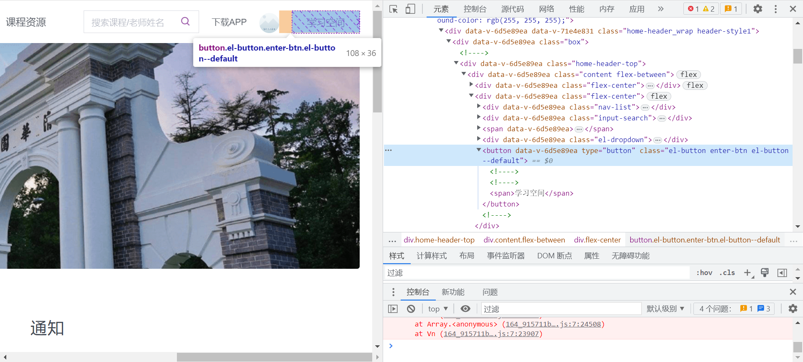

# yuketang_handler简单教学

`run.py`[简单运行视频](./演示.mp4)

可以看到，在通过`getcookie.py`正确获取了cookie的情况下，打开雨课堂界面直接就处于登录状态，之后点击学习空间、再点击上方上课提醒，就成功进入课堂啦~这部分代码对应于`run.py`的10~55行。

进入课堂后，由于默认会打开一个新标签页，所以需要57~62行切换一下窗口。

之后，根据mode的不同，会进入到不同的工作模式：

- 提醒答题模式：64~74行，其原理是通过检测当前PPT页面的class_name是否是`"page-exercise"`来判断当前是否有题，如果是则发出蜂鸣
- 自动答题模式：76~114行，其原理是不断尝试点击选项以及提交按钮，如果点击失败则说明当前不是题，那就休息5秒再继续，如果点击成功了就说明是题，也顺便直接交上了（笑死

### 原理

使用selenium库，通过模仿用户点击的方式执行一系列操作（登录、打开指定课程上课界面、点击选项并提交等）。基本上思路很简单，就是将日常中需要自己完成的操作交给代码去完成即可。所以这里面最困难的一点就是如何让代码点击指定的元素（或者说按钮）。

不妨先看看下面这个例子：现在我已经通过cookie登录进去了，在这个主界面，我希望点击学习空间，那我需要怎么办呢？

答案是F12打开开发者模式，然后在右边的DOM树上一级一级根据左边界面的变化最终定位到对应元素（具体操作过程可以参看[这个视频](./如何确定一个元素的XPath.mp4)）在获取到该元素对应的XPath之后，就可以通过调用webDriver的`find_element_by_xpath`方法找到该元素啦~

之后的过程可能就稍微枯燥，就是需要耐心编写好每一步的点击（而且很尴尬的是如果涉及到编写答题逻辑的话，很有可能需要在上课时专门守着题发出来的时候去找XPath，这个过程其实有点磨人），如果有啥问题可以随时找我呢